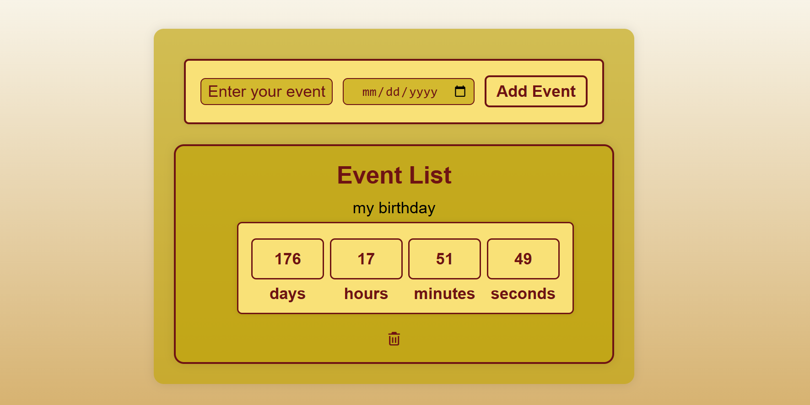

# Event-Countdown
# Event Countdown Timer

A simple and responsive Event Countdown web application built with HTML, CSS, and JavaScript.

## Features

- Add custom events with a title and date.
- Live countdown (Days, Hours, Minutes, Seconds).
- Automatically updates every second.
- Save events using Local Storage.
- Delete events anytime.
- Responsive and clean UI.

## Technologies Used

- HTML5
- CSS3
- JavaScript (ES6)
- Local Storage API

## How It Works

1. Enter the event name.
2. Select the event date.
3. Click **Add Event**.
4. The application displays a real-time countdown.
5. Events remain saved even after refreshing the page.

## Future Improvements

- Edit existing events.
- Dark Mode.
- Sort events by nearest date.
- Notification before the event.
- Search events.

## Screenshot

## Author

Abdelrahman Mohamed